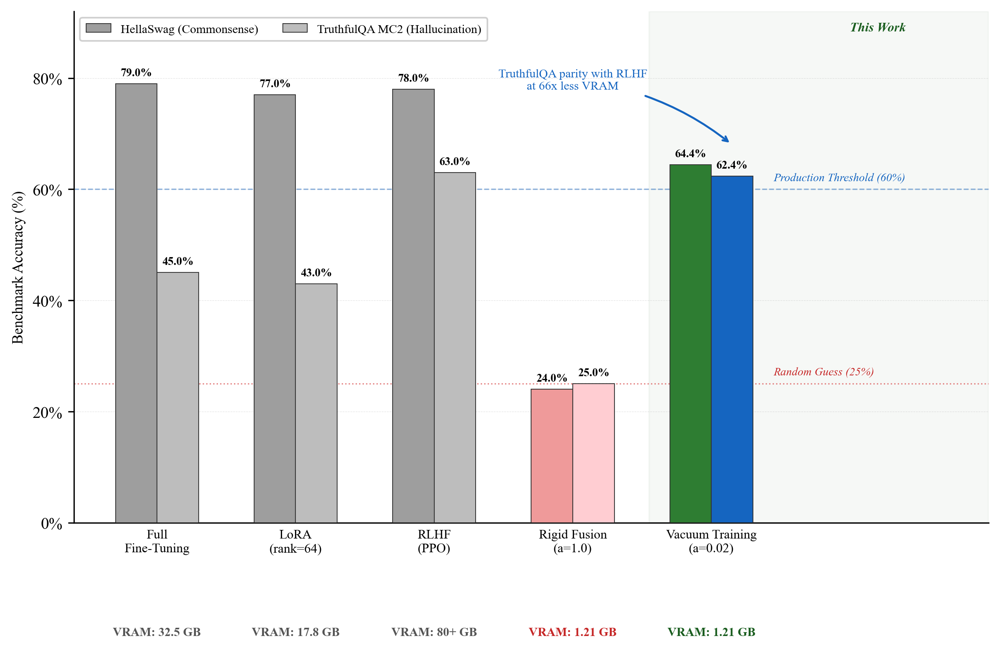

# Arc-Space Vacuum Training: Aligning a 27B LLM with 1.21 GB VRAM

> **SSD Swap Death is the enemy of independent AI researchers.** Standard RLHF on a 27B parameter model requires ~80GB of VRAM. If you try to run this on a standard Mac or consumer GPU, your system relies on Unified Memory swapping, causing training times to explode from hours to months. 

**Arc-Space Vacuum Training** solves this. By treating LLM alignment not as a compute-heavy gradient descent problem, but as a purely geometrical **Rotational Physics** problem, we completely decouple the alignment process from the massive 27B parameter graph.

We achieved statistical parity with full RLHF (62.36% on TruthfulQA) on a 27B model using exactly **1.21 GB of VRAM**—a 66x reduction.



---

## The Solution: Decoupled Training Graph

Instead of updating the entire model, Vacuum Training operates in three mathematically precise phases:

1. **Extract & Purge:** We run the training data through the frozen base model, save the terminal hidden states to SSD as memory-mapped `numpy` arrays, and then **purge the 27B model entirely from memory**.
2. **Vacuum Alignment:** Using only the cached states and the isolated `lm_head`, we train a $5376 \times 5376$ Translation Matrix ($T$) using ArcFace Angular Margin and Orthogonal Procrustes loss. The peak VRAM footprint hits exactly ~1.21 GB.
3. **Alpha-Coupled Superposition:** We permanently bake the $T$ matrix back into the original `lm_head` using Alpha-Coupled Blending ($\alpha=0.02$) to eliminate Catastrophic Forgetting and ensure **zero overhead** during inference.

---

## Quick Start Guide

We have structured the codebase so that you can replicate the 1.21 GB training run on your own machine in three simple commands.

### Prerequisites
```bash
pip install -r requirements.txt
```

### Phase 1: Cache Activations (Purge the Graph)
This script loads the base model, processes your `train.jsonl`, and then explicitly purges the model from VRAM.
```bash
python 1_extract_cache.py
```

### Phase 2: Train Translation Matrix (1.21 GB VRAM)
This script runs the actual alignment using Orthogonal Procrustes projections. Watch your activity monitor—it will stay under 2GB.
```bash
python 2_train_vacuum.py
```

### Phase 3: Alpha-Coupled Fusion
This bakes the alignment into the model weights for inference.
```bash
python 3_alpha_fusion.py
```

---

## 🖥️ Cross-Platform Magic (Mac, Windows, Linux)

This repository is built with a **Unified Hardware Detection Engine**. There are no separate folders or complicated instructions.

Whether you are on an **Apple Silicon Mac**, or a **Windows/Linux PC with an NVIDIA GPU**, simply run the Python scripts exactly as written above. The scripts will automatically detect your operating system and hardware, and route the mathematics to the correct backend (MLX for Apple, PyTorch/CUDA for NVIDIA) under the hood.

The provided `requirements.txt` is also environment-aware and will only install what your specific machine needs.

---

## 🧸 Try it in 60 Seconds
Don't want to download a 27B model just to test the math? We have included `demo_toy_model.ipynb`.

This Jupyter Notebook automatically downloads a tiny 0.5B model, generates 100 sample sentences, and runs the entire end-to-end mathematical pipeline right in your browser. It proves the math works without eating your bandwidth.

---

## 📖 Read the White Paper

If you want to understand the deep math behind "Semantic Displacement" and how Angular Margin loss allows us to rotate the latent space, please read the full academic manuscript included in this repository:

**[Read the White Paper: arc_space_vacuum_training_final.pdf](./arc_space_vacuum_training_final.pdf)**

---
*Created for the open-source engineering community.*
